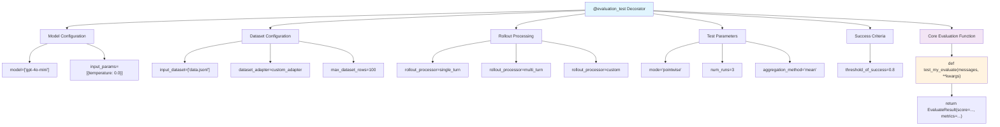

# Eval Protocol

**A modern Python framework for authoring, testing, and deploying LLM evaluation functions with pytest integration.**

## Key Features

- **Pytest-Based Evaluation**: Write evaluation functions as pytest tests with full parameterization
- **Pointwise Mode**: Define core evaluation logic once, parameterize everything else (models, datasets, thresholds)
- **Local Testing**: Quickly test your evaluation functions with sample data
- **Seamless Deployment**: Deploy your evaluation functions to platforms like Fireworks AI
- **Dataset Integration**: Direct integration with HuggingFace datasets and custom formats
- **Flexible Rollout Processing**: Support for single-turn, multi-turn, and custom rollout strategies

## Architecture: Parameterized Evaluation Components

The core innovation of Eval Protocol is separating evaluation logic from test configuration. Here's how the different elements are parameterized:



## Installation

```bash
pip install eval-protocol
```

## Quick Start: Pointwise Evaluation

The modern way to write evaluations in Eval Protocol uses the `@evaluation_test` decorator with `mode="pointwise"`. This separates your core evaluation logic from test configuration:

```python
from typing import List
from eval_protocol.pytest import evaluation_test, default_single_turn_rollout_processor
from eval_protocol.models import EvaluateResult, MetricResult, Message

@evaluation_test(
    input_dataset=["data/sample.jsonl"],
    model=["gpt-4o-mini"],
    input_params=[{"temperature": 0.0}],
    max_dataset_rows=100,
    threshold_of_success=0.8,
    rollout_processor=default_single_turn_rollout_processor,
    mode="pointwise",  # This is the key - enables row-by-row evaluation
)
def test_word_count_evaluate(messages: List[Message], **kwargs) -> EvaluateResult:
    """
    Core evaluation logic - everything else is parameterized in the decorator.
    """
    if not messages:
        return EvaluateResult(score=0.0, reason="No messages found")

    response = messages[-1].content or ""
    word_count = len(response.split())
    score = min(word_count / 100, 1.0)  # Normalize to 0-1

    return EvaluateResult(
        score=score,
        reason=f"Word count: {word_count}",
        metrics={
            "word_count": MetricResult(
                score=score,
                is_score_valid=word_count > 0,
                reason=f"Response has {word_count} words"
            )
        }
    )
```

## Key Benefits

1. **Clean Separation**: Your evaluation function only contains the core logic
2. **Full Parameterization**: Models, datasets, thresholds, rollout strategies all configured in the decorator
3. **Pytest Integration**: Run as regular pytest tests with full reporting and CI/CD integration
4. **Reusability**: Same evaluation logic can be tested with different configurations

## Batch Mode Example

For cases where you need to process the full dataset at once, use the default batch mode:

```python
from eval_protocol.pytest import default_single_turn_rollout_processor, evaluate, evaluation_test
from examples.math_with_format_and_length.main import evaluate as math_fl_evaluate
from tests.pytest.helper.gsm8k_to_evaluation_row import gsm8k_to_evaluation_row

@evaluation_test(
    input_dataset=["development/gsm8k_sample.jsonl"],
    dataset_adapter=gsm8k_to_evaluation_row,
    model=["accounts/fireworks/models/kimi-k2-instruct"],
    input_params=[{"temperature": 0.0}],
    max_dataset_rows=5,
    threshold_of_success=0.0,
    rollout_processor=default_single_turn_rollout_processor,
    # No mode specified = defaults to "batch"
)
def test_math_format_length_dataset(input_dataset, input_params, model):
    """Run math with format and length evaluation on sample dataset."""
    return evaluate(input_dataset, math_fl_evaluate)
```

In batch mode, your test function receives the full dataset and must return a list of `EvaluationRow` instances.

## Running Tests

Run your evaluation as a regular pytest test:

```bash
# Run specific evaluation
pytest tests/test_word_count_evaluate.py -v

# Run all evaluations
pytest tests/ -k "evaluate" -v

# Run with specific parameters
pytest tests/test_word_count_evaluate.py::test_word_count_evaluate -v
```

## Dataset Integration

Create dataset adapters to convert your data format to evaluation rows:

```python
from typing import Any, Dict, List
from eval_protocol.models import EvaluationRow, Message

def my_dataset_adapter(data: List[Dict[str, Any]]) -> List[EvaluationRow]:
    """Convert your dataset format to EvaluationRow format."""
    return [
        EvaluationRow(
            messages=[Message(role="user", content=row["question"])], 
            ground_truth=row["answer"]
        )
        for row in data
    ]
```

## Configuration Options

The `@evaluation_test` decorator supports extensive configuration:

### Core Parameters
- **`mode`**: `"pointwise"` for row-by-row evaluation, `"batch"` for full dataset processing
- **`model`**: List of model identifiers to test against
- **`input_dataset`**: Paths to JSONL dataset files
- **`dataset_adapter`**: Function to convert dataset format to EvaluationRow format

### Evaluation Control
- **`threshold_of_success`**: Minimum aggregated score for test to pass
- **`max_dataset_rows`**: Limit dataset size for faster testing
- **`num_runs`**: Number of evaluation runs for stability testing
- **`aggregation_method`**: How to combine scores (`"mean"`, `"max"`, `"min"`)

### Model Configuration
- **`input_params`**: Generation parameters like temperature, top_p
- **`rollout_processor`**: Strategy for model interaction (single-turn, multi-turn, custom)

## Examples

- **Word Count Evaluation (Pointwise)**: `tests/pytest/test_pytest_word_count_example.py`
- **Math Evaluation (Batch)**: `tests/pytest/test_pytest_math_example.py`
- **Math Format & Length (Batch)**: `tests/pytest/test_pytest_math_format_length.py`
- **Migration Guide**: `tests/pytest/README_word_count_migration.md`

## Migration from Old Pattern

The old `@reward_function` decorator is deprecated. The new pytest-based approach provides:

- Better separation of concerns
- Full pytest integration
- Easier testing and CI/CD integration
- More flexible parameterization

See the migration guide for detailed examples.

## License

Eval Protocol is released under the Apache License 2.0.